# Fairing Control System

A web-based system developed to digitalize, organize, and track the operational process of receiving, inspecting, and registering motorcycle fairings.

The project focuses on process organization, traceability, operational control, user management, and reducing manual activities.

---

## About the Project

The Fairing Control System centralizes the fairing receiving workflow, allowing each stage to be monitored from delivery registration to the completion of the inventory entry.

The application supports delivery registration, physical inspection, invoice attachment and verification, discrepancy tracking, approval or rejection workflows, and complete process history.

It also includes role-based access control, allowing permissions to be assigned according to each user's responsibilities.

---

## Main Features

- User authentication and role-based access control
- User and permission management
- Delivery and receiving management
- Physical inspection and discrepancy tracking
- Part reference and description lookup
- Excel-based parts catalog integration
- NF-e attachment and verification
- Approval, rejection, and invoice replacement workflow
- Receiving status and process tracking
- Complete history and activity timeline
- Operational dashboard
- Search and filtering by receipt, user, status, or invoice
- Change tracking and administrator notifications

---

## Process Flow

```text
New Delivery
     ↓
Receiving
     ↓
Physical Inspection
     ↓
Invoice Attachment
     ↓
Invoice Verification
     ↓
Approval or Rejection
     ↓
Entry Completed
     ↓
Process Finalized
```

When an invoice is rejected, the process returns for correction or replacement and a new verification is performed.

---

## Access Control

| Role | Access |
|---|---|
| Administrator | Full system access |
| Operator | Receiving and operational management |
| Inspector | Invoice and document verification |
| Supplier | New delivery registration |

Permissions can be configured according to each user's role.

---

## Traceability

Each receiving record maintains a history of the process, including:

- Delivery creation
- Responsible users
- Receiving start
- Physical inspection
- Reference and description changes
- Invoice attachment
- Invoice verification
- Approval or rejection
- Rejection reason
- Entry completion
- Date and time of each stage

This provides visibility throughout the complete operational workflow.

---

## Dashboard

The dashboard provides operational indicators for a selected period, including:

- Painted fairings
- Generated receipts
- Processed part references
- Inspected quantities
- Selected analysis period

The information can also be viewed grouped by part reference.

---

## System Interface

### Home

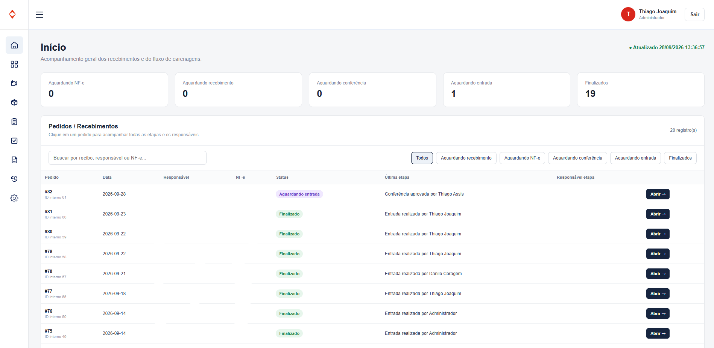

### Dashboard

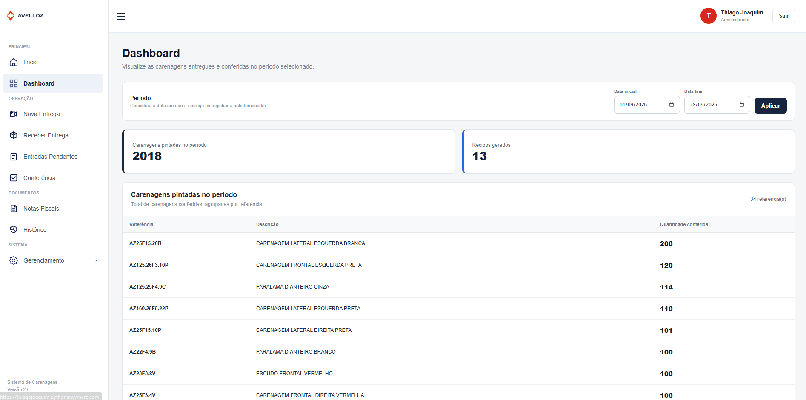

### New Delivery

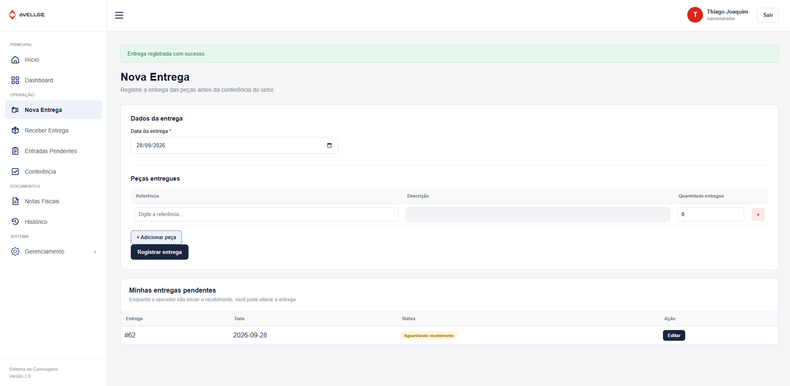

### Receive Delivery

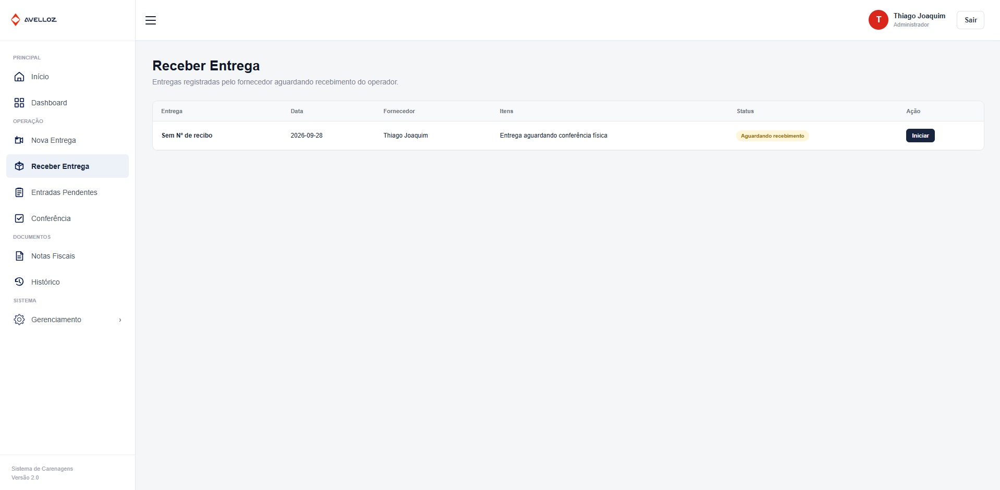

### Receiving Entry

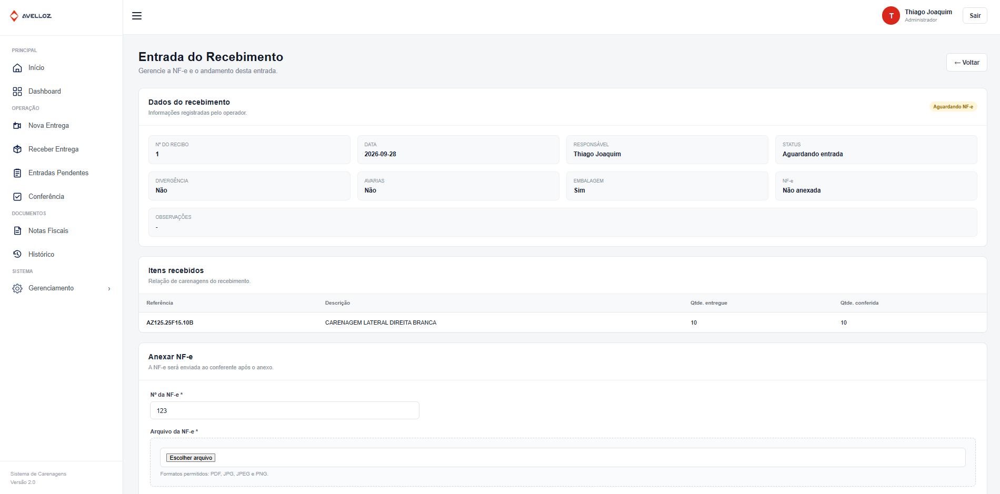

### Physical Inspection

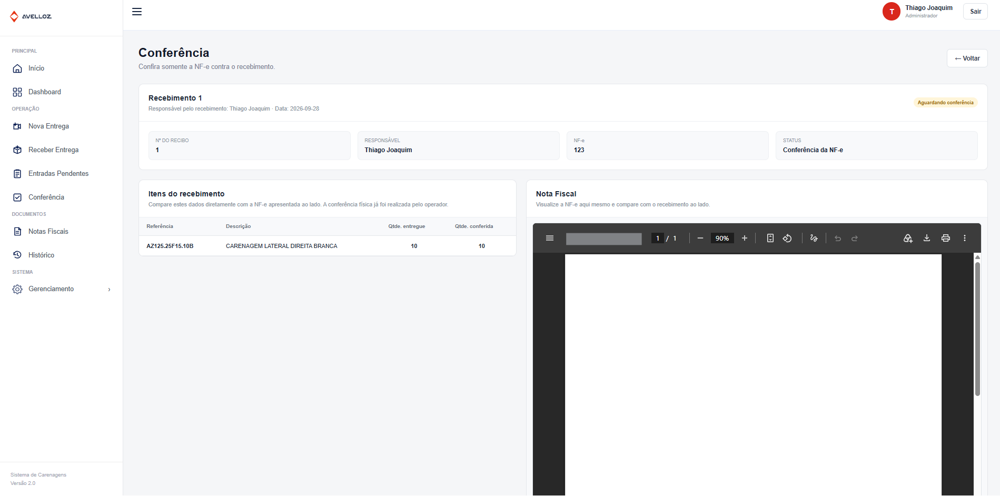

### Approved Entry

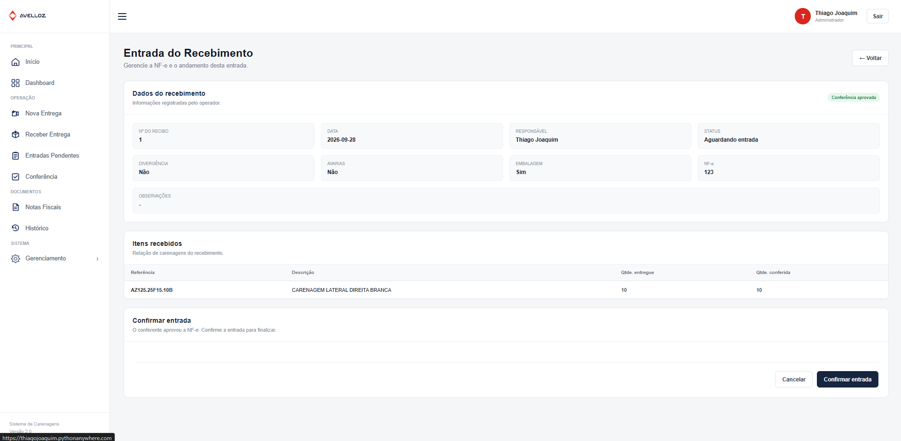

### Pending Entries

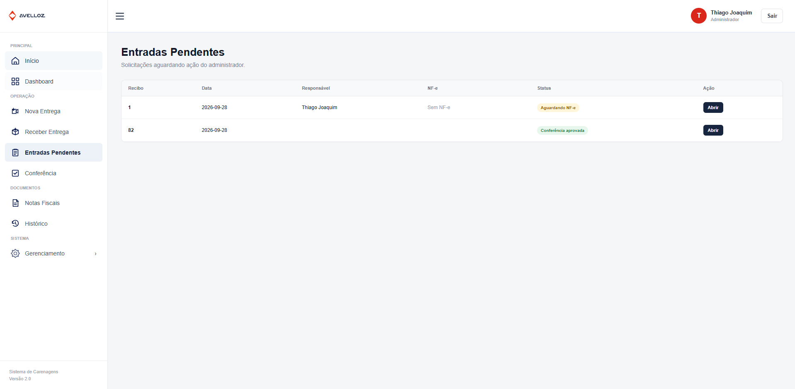

### Invoices

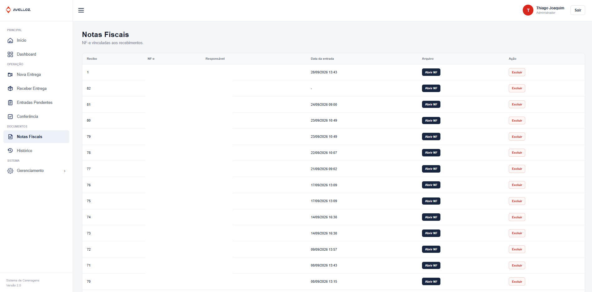

### History

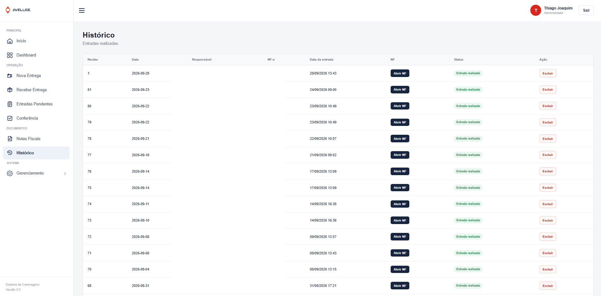

### User Management

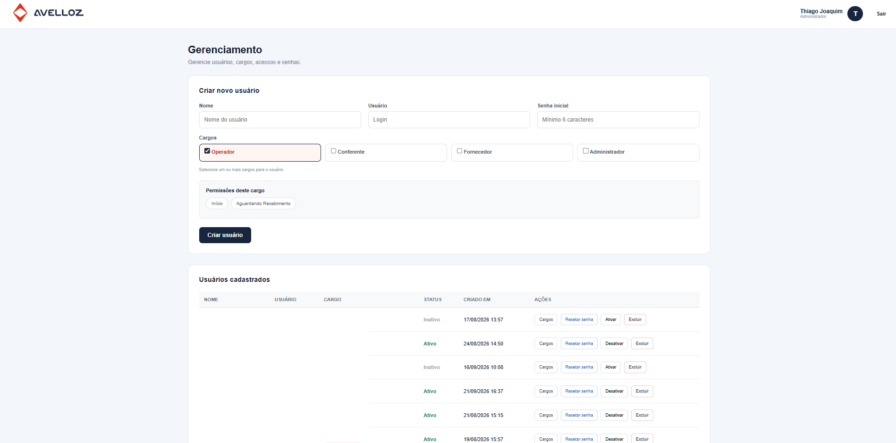

---

## Technologies

### Languages

- Python
- HTML5
- CSS3
- JavaScript

### Tools and Technologies

- Flask
- SQLite
- OpenPyXL
- JSON
- Excel

---

## Project Structure

```text
sistema-controle-carenagens/
│
├── app.py
├── README.md
│
├── static/
│   └── icons/
│       ├── conferencia.svg
│       ├── dashboard.svg
│       ├── entradas-pendentes.svg
│       ├── gerenciamento.png
│       ├── historico.svg
│       ├── inicio.svg
│       ├── logo-simbolo.svg
│       ├── notas-fiscais.svg
│       ├── nova-entrega.svg
│       └── novo-recebimento.svg
│
├── templates/
│   ├── gerenciamento.html
│   ├── index.html
│   ├── login.html
│   └── trocar_senha.html
│
└── screenshots/
    ├── inicio.png
    ├── dashboard.png
    ├── nova_entrega.png
    ├── receber_entrega.png
    ├── entradas_pendentes.png
    ├── entrada_do_recebimento.png
    ├── conferencia.png
    ├── confirmar_entrada.png
    ├── nfes.png
    ├── historico.png
    └── gerenciamento.png
```

> Operational databases, invoices, and other internal files should not be committed to a public repository.

---

## Project Goal

The project was created to transform a manual operational workflow into a centralized digital process, improving organization, traceability, and visibility across the receiving and inspection stages.
